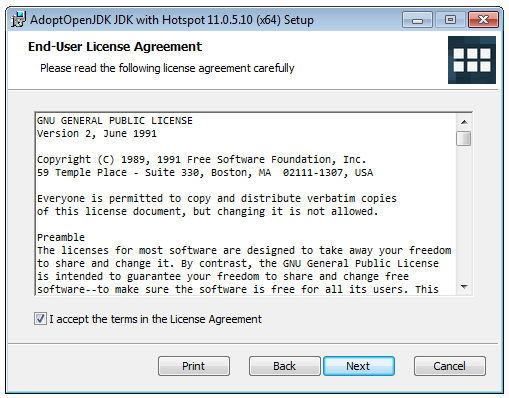

# Отчёт о тестировании <Проверка инструкции по установке OpenJDK11 на Windows 10>

## Краткое описание

<13.02.2020> - <13.02.2020> было проведено <тестирование установки> приложения <OpenJDK11>.

На тестирование затрачено: <15 минут>

## Описание процесса тестирования

В процессе тестирования использовались следующие артефакты:
* Тестовый сценарий:
### Инструкция по установке OpenJDK11

Шаг 1. Перейдите на сайт [adoptopenjdk.net](https://adoptopenjdk.net). 

Шаг 2. Выберите опции как на скриншоте ниже и нажмите на кнопку скачивания:


Шаг 3. Запустите на установку скачанный MSI-файл и нажмите кнопку "Next":


Шаг 4. Прочитайте и согласитесь с условиями лицензии:



Шаг 5. Выберите опции как на экране (удостоверьтесь, что установка происходит в `Program Files` и опция `Add to PATH` выбрана):


Шаг 6. Нажмите на кнопку "Install":


Шаг 7. Дождитесь окончания установки и нажмите на кнопку "Finish":


Откройте терминал и выполните команду:
```shell script
java -version
```

```
openjdk version "11.0.5" 2019-10-15
OpenJDK Runtime Environment AdoptOpenJDK (build 11.0.5+10)
OpenJDK 64-Bit Server VM AdoptOpenJDK (build 11.0.5+10, mixed mode)
```

**Важно**: вы должны открывать терминал уже после того, как произвели установку.


В качестве тестовых данных использовались данные [openjdk11-manual.md] (https://github.com/netology-code/javaqa-homeworks/blob/master/intro/openjdk11-manual.md)
* При выполнении всех описанных в тестовом сценарии шагов приложение OpenJDK11 устанавливается на компьютер.
* При введении в терминале команды "java -version" появляется сообщение:
"openjdk version "11.0.5" 2019-10-15
OpenJDK Runtime Environment AdoptOpenJDK (build 11.0.5+10)
OpenJDK 64-Bit Server VM AdoptOpenJDK (build 11.0.5+10, mixed mode)".


Тестирование производилось в следующем окружении:
* <Windows 10 x64>
* <jdk-11.0.6.10>

